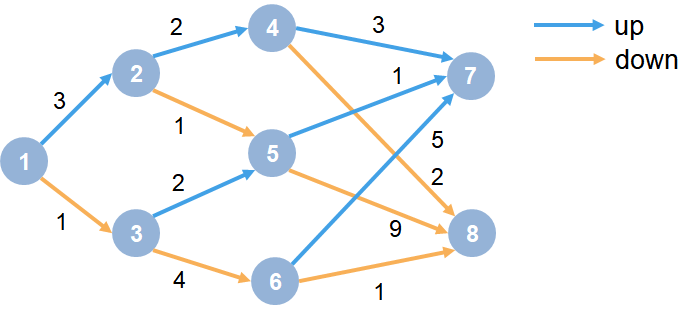
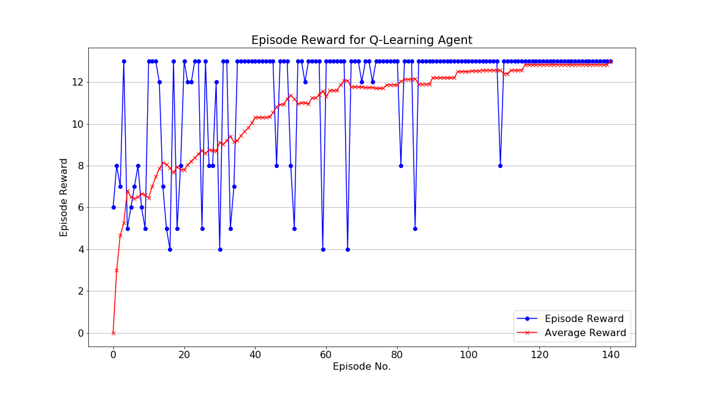

# Training Q-learning agent in an MDP environment
This work is based on [this example](https://www.mathworks.com/help/reinforcement-learning/ug/train-reinforcement-learning-agent-in-mdp-environment.html) from [mathworks.com](https://www.mathworks.com). Please enjoy attached python notebook in this repository to understand how to train Q-learning agent in a generic Markov Decision Process (MDP) environment.

To have better understanding in this work, I introduce sections as follows:
- [Reinforcement learning](#reinforcement-learning)
- [Problem modeling with MDP](#problem-modeling-with-mdp)
- [Exploration vs Exploitation](#exploration-vs-exploitation)
- [Q-learning](#q-learning)
- [Parameters](#parameters)
- [Results](#results)

See [this notebook](q_agent_mdp.ipynb) for better understanding.

## Reinforcement learning

Reinforcement learning framework

The reinforcement learning approach selects actions that maximize expected rewards generated by decisions. The agent learns how to choose actions through trial-and-error interactions with a dynamic environment to observe the signals or rewards returned from previous states. The agent may take a long sequence of actions to have a delayed rewards, receiving insignificant reinforcement, then finally arrive at a state with high reinforcement.

## Problem modeling with MDP
Assume that the environment of the problem is fully observable. Precisely, we can get all informations concerning all states (from begin to termianl states) and all state-to-state transitions. Therefore, we can formulate a generic MDP model. An example MDP can be represented as the following graph:

MDP Environment

From this example, at each state there is a decision to go up or down. The agent begins from state 1. The state 7 and 8 are terminal states. The agent receives a reward equal to the value on each transition in the graph.

## Q-learning
In this work, we apply the Q-learning agent to train this MDP environment and solve the problem. The training goal is to collect the maximum cumulative reward. The algorithm has a function that calculates the quality of a state-action combination:

To iteratively improve the behavior of the learning agent, at each time  the agent selects an action , observes a reward , enters a new state  and a new  is updated with the following equation:

\gets(1-\alpha)\cdot{Q(s_t,a_t)}+\alpha\cdot(r+\gamma\cdot\max_{a}{Q(s_{t+1},a)))

where
 : current state of the agent. 
 : current action picked according to some policy. 
 : next state where the agent ends up. 
: next best action to be picked using current Q-value estimation, i.e. pick the action with the maximum Q-value in the next state. 
 : current reward observed from the environment in response of current action. 
 : discounting Factor for Future Rewards and . 
 : learning rate or step length taken to update the estimation of ).

Note that future rewards are less valuable than current rewards so they must be discounted. Since Q-value is an estimation of expected rewards from a state, discounting rule applies here as well.

## Exploration vs Exploitation
We select the action to take using 𝜖 -greedy policy. -greedy policy of is a simple policy of selecting actions using the current Q-value estimations. It goes as follows:

- with probability () select the action which has the highest Q-value. 
- with probability () randomly select any action. 

## Parameters
### Q-learning agent parameters
To create Q-learning agent, the discount factor, learning rate and epsilon-greedy exploration shall be configured as follows:
|Parameter   |Value   |
|---|--:|
|Discount factor,  | 1.0 |
|Learning rate,    | 1.0 |
|Epsilon,      | 0.9 |
|Epsilon decay,      | 0.01 |
|Final Epsilon,      | 0.01 |

### Training parameters
To train the agent, number of steps, episodes, criteria to stop training and reward averaging window size  are configured as follows:
|Parameter   |Value/criteria   |
|---|--:|
|Maximum steps per episode                                                                     | 50   |
|Maximum episodes                                                                              | 200  |
|Stop training criteria                                                                        | |
|Reward averaging window size                                                                  | 30   |

## Results

